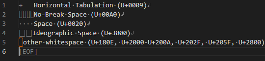

# Visible Whitespace

An extension that makes whitespace visible.

## Features

This extension visually displays the following whitespace characters:

* H-TAB (U+0009) - Disabled by default.
* LF (U+000A) or CRLF (U+000D + U+000A)
* Space (U+0020) - Disabled by default.
* No-Break Space (U+00A0)
* Ideographic Space (U+3000)
* other whitespace (U+180E, U+2000-U+200A, U+202F, U+205F, U+2800)
* EOF

## Extension Settings

* `visibleWhitespace.enabledLanguageIds`: A list of languageIds for which this extension should be enabled. If empty, it will be enabled for all languageIds. e.g. `[ "plaintext", "markdown" ]`
* `visibleWhitespace.updateDelay`: Delay time in milliseconds before updating. Smaller values will color faster, but will increase processing cost.
* `visibleWhitespace.overlayColor`: Specify the color of the overlay text. eg. `#RRGGBB`, `rgb(R,G,B)` or `rgba(R,G,B,A)` format.
* `visibleWhitespace.htab.enable`: Enables making horizontal tabs visible. (default: false)
* `visibleWhitespace.htab.text`: Text to overlay on horizontal tabs.
* `visibleWhitespace.newLine.enable`: Enables making new line visible.
* `visibleWhitespace.newLine.lf`: Text of LF.
* `visibleWhitespace.newLine.crLf`: Text of CRLF.
* `visibleWhitespace.newLine.color`: Color of text that represents new line.  eg. `#RRGGBB`, `rgb(R,G,B)` or `rgba(R,G,B,A)` format.
* `visibleWhitespace.space.enable`: Enables making spaces visible. (default: false)
* `visibleWhitespace.space.text`: Text to overlay on spaces.
* `visibleWhitespace.nbsp.enable`: Enables making no-break spaces visible.
* `visibleWhitespace.nbsp.text`: Text to overlay on no-break spaces.
* `visibleWhitespace.widespace.enable`: Enables making wide-spaces visible.
* `visibleWhitespace.widespace.text`: Text to overlay on wide-spaces.
* `visibleWhitespace.other.enable`: Enables making other whitespaces visible.
* `visibleWhitespace.other.borderColor`: Border color of other whitespace.  eg. `#RRGGBB`, `rgb(R,G,B)` or `rgba(R,G,B,A)` format.
* `visibleWhitespace.eof.enable`: Enables making EOF visible.
* `visibleWhitespace.eof.text`: Text of EOF.
* `visibleWhitespace.eof.color`: Color of text that represents EOF.  eg. `#RRGGBB`, `rgb(R,G,B)` or `rgba(R,G,B,A)` format.

The default for `visibleWhitespace.htab.enable` and `visibleWhitespace.space.enable` is disable because the standard `editor.renderWhitespace` is used.

If you want to use this extension instead of the standard `editor.renderWhitespace`, set `"editor.renderWhitespace": "none"` and set the above definition to `true`.

# FAQ

## Q. Mixed new line code is not displayed.

Even if the new line code of the file is mixed, it seems to correct the new line code when loading VSCode. On the editor, it is unified to either LF or CRLF.

## Q. When I delete some lines, the newline mark remains for a moment.

Reducing the screen update delay time will improve this somewhat, but will increase the processing cost.
If it really bothers you, set `visibleWhitespace.newLine.enable` to `false`.
